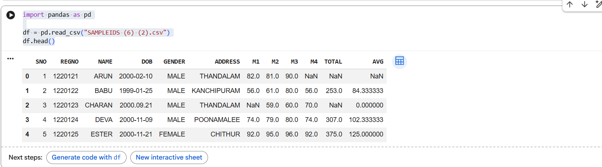
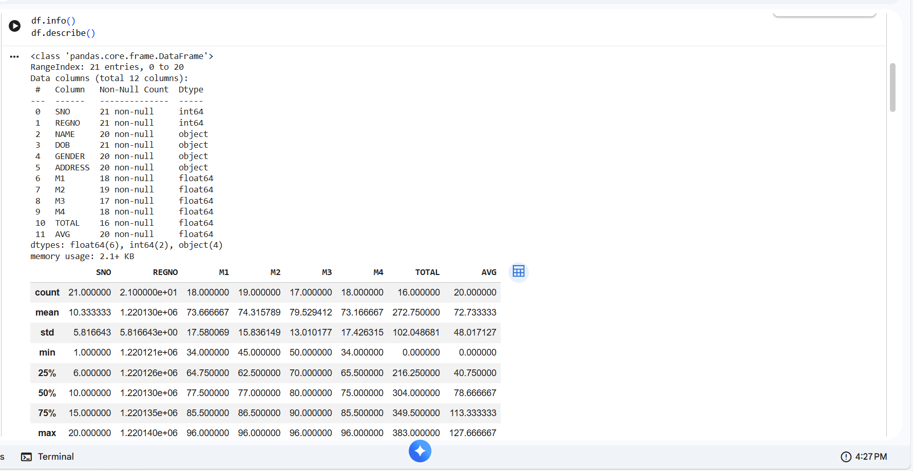
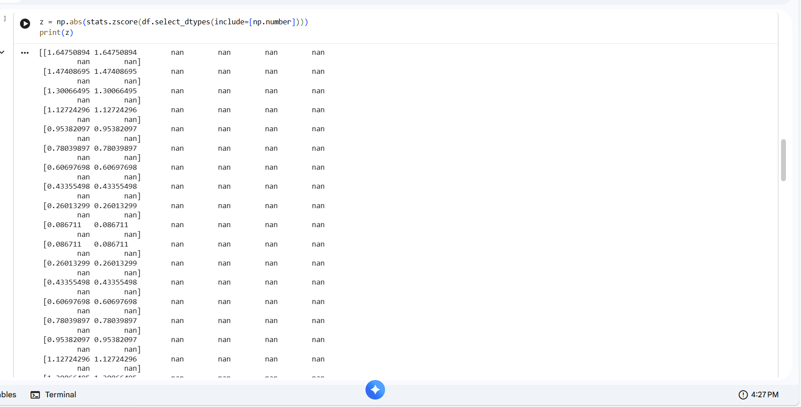
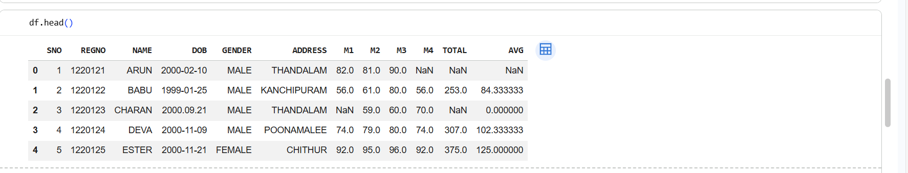
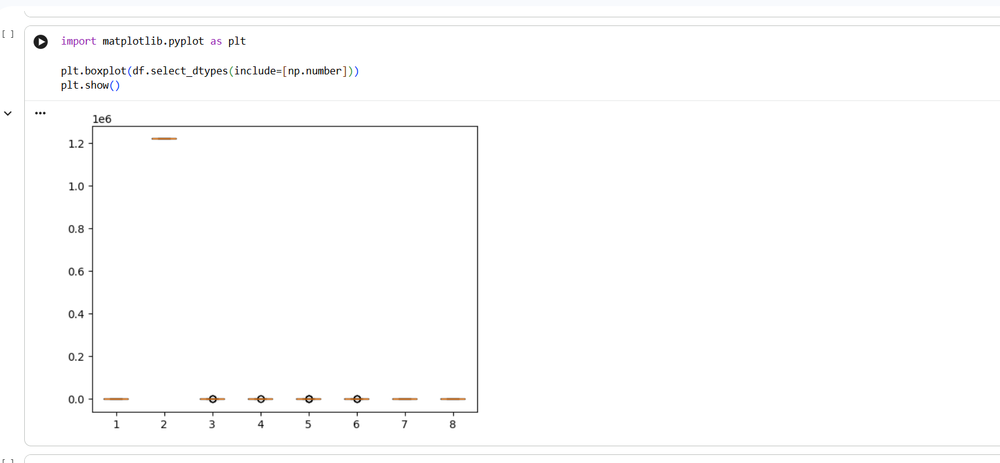
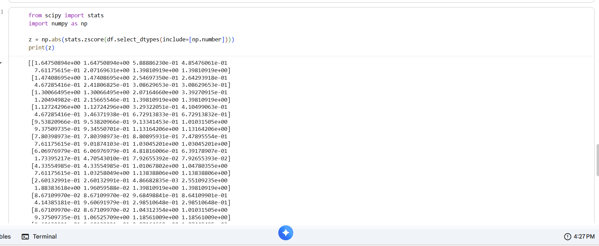
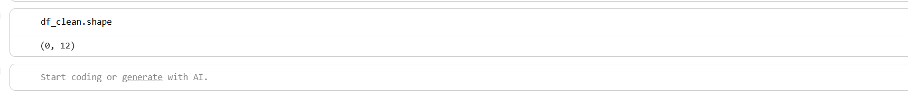

#EX.NO:1
Data Cleaning Process

# AIM
To read the given data and perform data cleaning and save the cleaned data to a file.

# Explanation
Data cleaning is the process of preparing data for analysis by removing or modifying data that is incorrect ,incompleted , irrelevant , duplicated or improperly formatted. Data cleaning is not simply about erasing data ,but rather finding a way to maximize datasets accuracy without necessarily deleting the information.

# Algorithm
STEP 1: Read the given Data

STEP 2: Get the information about the data

STEP 3: Remove the null values from the data

STEP 4: Save the Clean data to the file

STEP 5: Remove outliers using IQR
+
+STEP 6: Use zscore of to remove outliers

# Coding and Output
           import pandas as pd
           import numpy as np
           import matplotlib.pyplot as plt
           from scipy import stats
from google.colab import files
uploaded = files.upload()
import pandas as pd

df = pd.read_csv("SAMPLEIDS (6) (2).csv")df.head()

df.info()
df.describe()

df.isnull().sum()

df.drop_duplicates(inplace=True)
z = np.abs(stats.zscore(df.select_dtypes(include=[np.number])))
print(z)

df_clean.to_csv("cleaned_data.csv", index=False)
df.head()

df.shape
)
plt.show()

from scipy import stats
import numpy as np

z = np.abs(stats.zscore(df.select_dtypes(include=[np.number])))
print(z)

df_clean.shape

# Result
         The following data cleaning has been done successfully
